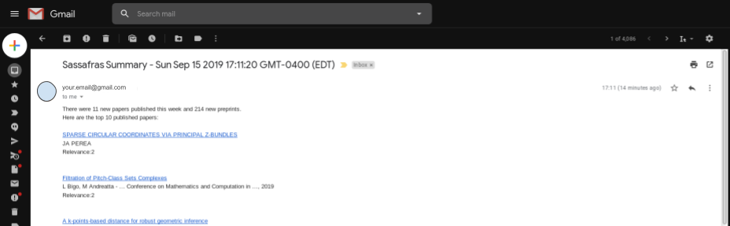
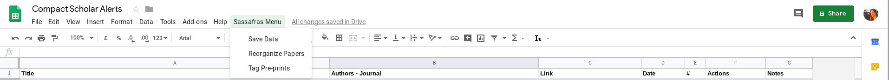

# SASSAFRAS 

Simple Automatic Scholar Sorter Appropriate For Researchers And Scientists (credit for the awesome acronym goes to [Thomas Varley](https://github.com/thosvarley))

This is a small script that looks for **unread Google Scholar Alerts** emails in your Gmail account and saves each paper in a Google Spreadsheet as:

  Title/ Authors - Journal/ URL of the paper/Date/ number of Alerts that contained the paper  
 
  *note: an older version had a search query column now substituted with the email time-stamp, you can still access that option by changing the `date_not_query` variable.*
 
### The possibilities are endless
Personally, I have an extra column with a `Data Validation` drop-down menu so i can mark the papers as I go through them. One can write a script that sends emails with the list of papers marked in a specific way, or the script can run automatically every Monday, or the day after your journal club to get new ideas!

Take a look at the available functions for [GoogleSheets](https://developers.google.com/apps-script/reference/spreadsheet/spreadsheet-app) and [Gmail](https://developers.google.com/apps-script/reference/gmail/gmail-app) to customize your own script.
 
## How does it work?
The script reads the unread Google Scholar Alerts emails

Then saves the article's information in a SpreadSheet separating published articles (in `Papers`) and pre-prints (in `PrePrints`)

The script can also automatically send an email of the top papers being added
(defaults: 5 published and 5 pre-prints) ordered by the number of occurrences.

## How to run it:
1. Open a new Google SpreadSheet
2. Go to **Tools > Script Editor**
3. Copy-paste the .gs files in the `code` folder.
4. Customize the variable so they can work with your account  
  `sassafras.gs` : change the **SEARCH_QUERY** variable so that it can detect your unread Google Scholar Alerts (test run it on your Gmail)  
  `summary.gs` : change the **emailAddress** variable to your Gmail address.
5. Choose the options that best suit you in `sassafras.gs`, or keep the following defaults:

  - [ ] **del_emails** // if `true` deletes the GoogleAlert emails as it reads their content otherwise it just marks them as "read";  
  - [x] **send_summary** // if `true` sends an email summary of the new top 10 papers added;  
  - [x] **date_not_query** // if `true` adds the date of the email in column 5, otherwise adds the subject of the GoogleAlert;
  - [ ] **date_separator** // if `true` adds a separator before writing the new papers' list in the GoogleSheet;
  - [ ] **del_past** // if `true` deletes past list of papers before adding the new one.
6. Run the **save_email** function.
---
7. OPTIONAL: substitute the RegEx for keyword search and sheets names in the **labels** variables in `cleaning.gs` if you need to clean/organize your list.
8. Run the **run_labels** function.

## The custom menu
The `options.gs` script has a function that will add a custom menu with selected sassafras functions to your SpreadSheet to make it easier to run.  
To make it work the script just need to be saved in your script editor, and refresh the page of your SpreadSheet.

## How to run the script automatically every week
1. In Google Scripts go to **Edit > Current project's triggers**  
2. It will open a new page saying **No results - Try adjusting your filter criteria or create a new trigger**  
3. Click on **create a new trigger**  

  - Choose to run the function **saveEmails**  
  - Deployment **Head**  
  - Select Event source **Time-driven**  
  - Type of time based trigger **Week timer**  
  - Select day and time you want the code to run at every week
