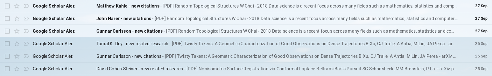
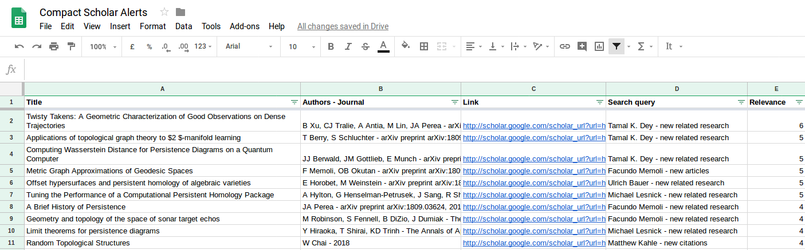

# S.A.S.S.A.F.R.A.S. 

Simple Automatic Scholar Sorter Appropriate For Researchers And Scientists (credit for the awesome acronym goes to [Thomas Varley](https://github.com/ThosV))

This is a small script that looks for **unread Google Scholar Alerts** emails in your Gmail account and saves each paper in a Google Spreadsheet as:

  Title/ Authors - Journal/ url of the paper/Date/ number of Alerts that contained the paper 
  *notice: an older version had a search query column now substituted with the email time-stamp.*
  

  
The script reads the unread Google Scholar Alerts emails

Then saves the article's information in a GoogleSheet

**UPDATE:** It is optional, but the script can automatically send an email of the top papers being added 
(defaults: 5 published and 5 pre-prints) ordered by number of occurances.

## How to run it:
1. Open a new Google Sheet
2. Go to **Tools > Script Editor**
3. Copy paste the .gs file
4. Add your information  
  `sassafras.gs` : change the **SEARCH_QUERY** variable so that it can detect your unread Google Scholar Alerts (test run it on your Gmail)  
  `summary.gs` : change the **emailAddress** variable to your Gmail address.
5. Choose the options that best suit you in `sassafras.gs`, or keep the following defaults:

  - [ ] del_emails // if `true` deletes the GoogleAlert emails as it reads their content otherwise it just marks them as "read";  
  - [ ] send_summary // if `true` sends an email summary of the new top 10 papers added;  
  - [x] date_not_query // if `true` adds the date of the email in column 5, otherwise adds the subject of the GoogleAlert;
  - [ ] date_separator // if `true` adds a separator before writing the new papers' list in the GoogleSheet;
  - [ ] del_past // if `true` deletes past list of papers before adding the new one.
6. Run the **save_email** function
---
7. OPTIONAL: substitute the keywords and sheets names in the **run_labels** function in `cleaning.gs` if you need to clean/organize your list.
8. Run the **run_labels** function

## The possibilities are endless
Personally, I have an extra column with a Data Validation drop down menu so i can mark the papers as i go through them. One can write a script that sends emails with the list of papers marked in a specific way, or the script can run automatically every monday, or the day after your journal club to get new ideas! 

Take a look at the available functions for [GoogleSheets](https://developers.google.com/apps-script/reference/spreadsheet/spreadsheet-app) and [Gmail](https://developers.google.com/apps-script/reference/gmail/gmail-app) to customize your own script.
