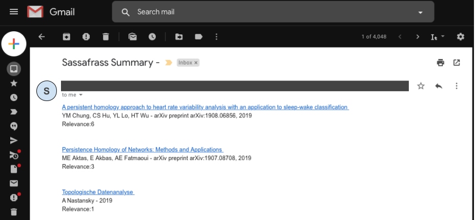

# S.A.S.S.A.F.R.A.S.
Simple Automatic Scholar Sorter Appropriate For Researchers And Scientists (credit for the awesome acronym goes to [Thomas Varley](https://github.com/ThosV))

This is a small script that looks for **unread Google Scholar Alerts** emails in your Gmail account and saves each paper in a Google Spreadsheet as:

  Title/ Authors - Journal/ Google Scholar link/Date/ number of Alerts that contained the paper 
  *notice: an older version had a search query column now substituted with the email time-stamp.*
  
The script reads the unread Google Scholar Alerts emails

Then saves the article's information in a GoogleSheet

**UPDATE:** Right now it is optional, but the google script can send an email of the top 10 papers ordered by number of occurances.

## How to run it:
1. Open a new Google Sheet
2. Go to **Tools > Script Editor**
3. Copy paste the .gs file
4. Change the **SEARCH_QUERY** variable so that it can detect your unread Google Scholar Alerts *(the script will automatically mark them as read after saving them)*
5. Run the **save_email** function
---
6. OPTIONAL: substitute your email address in the **send_email** function in `summary.gs` if you want an email summary of the top 10 papers of the week.
5. Run the **send_email** function
---
6. OPTIONAL: substitute the keywords and sheets names in the **run_labels** function in `cleaning.gs` if you need to clean your list.
5. Run the **run_labels** function

## The possibilities are endless
I personally have an extra column with a Data Validation drop down menu so i can mark the papers as i go through them. One can write a script that sends emails with the list of papers marked in a specific way, or the script can run automatically every monday, or the day after your journal club to get new ideas! 

Take a look at the available functions for [GoogleSheets](https://developers.google.com/apps-script/reference/spreadsheet/spreadsheet-app) and [Gmail](https://developers.google.com/apps-script/reference/gmail/gmail-app) to customize your own script.
